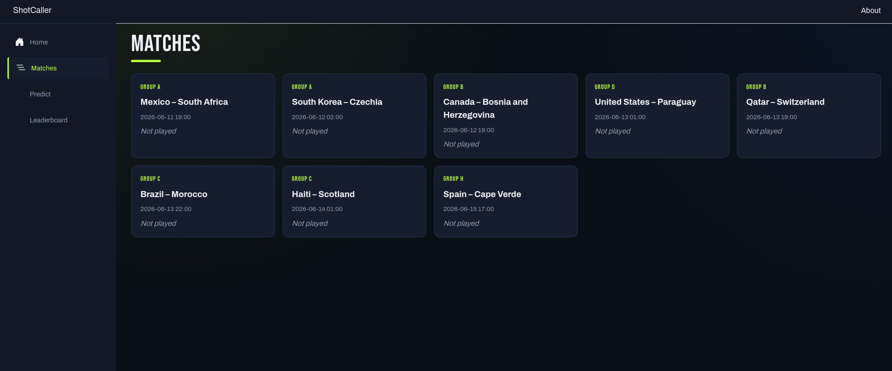
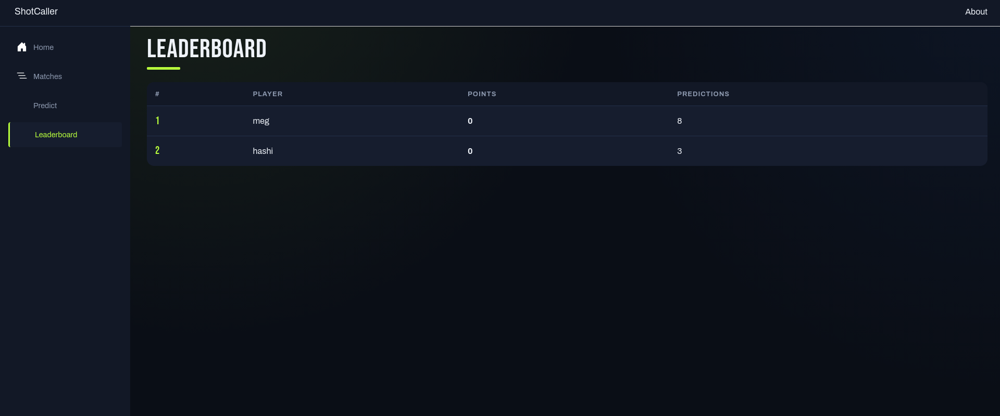

<h1 align="center">ShotCaller</h1>

<p align="center">
  A World Cup 2026 match predictor — submit score predictions before kickoff,
  earn points based on how close you were, and compete against everyone else on
  a live leaderboard. A full-stack app with a Blazor WebAssembly frontend and a
  Clean Architecture .NET Web API behind it.
</p>

<p align="center">
  <a href="https://github.com/Megjafari/ShotCaller/actions/workflows/ci.yml">
    
</p>

<p align="center">
  
  
  
  
  
  
  
  
  
  
</p>

---

## Table of Contents

- [Overview](#overview)
- [Screenshots](#screenshots)
- [Features](#features)
- [Architecture](#architecture)
  - [Project Structure](#project-structure)
  - [Data Flow](#data-flow)
  - [Scoring](#scoring)
- [Tech Stack](#tech-stack)
- [API Reference](#api-reference)
- [Getting Started](#getting-started)
  - [Prerequisites](#prerequisites)
  - [Configuration](#configuration)
  - [Running Locally](#running-locally)
- [Testing](#testing)
- [Deployment](#deployment)
- [Design Decisions & Notes](#design-decisions--notes)
- [Roadmap](#roadmap)

---

## Overview

ShotCaller is a full-stack web app for predicting the results of 2026 World Cup matches.
Before a match kicks off, users submit a predicted scoreline. Once the real result is
entered, every prediction on that match is scored automatically, and the leaderboard
ranks players by their total points across the tournament.

It was built as a school project for the C# II course, with the goal of demonstrating a
clean full-stack slice: a Blazor WebAssembly frontend talking to a .NET Web API, with a
SQL Server database behind Entity Framework Core and a backend covered by xUnit tests.

The backend is organized around Clean Architecture, with a strict separation between the
domain, the application layer, the infrastructure integrations, and the API host. The
frontend is a separate Blazor WASM project in the same monorepo.

## Screenshots

<p align="center">
  
  
</p>

## Features

### Match listing
All tournament matches are listed with their group, kickoff time, and result. Matches
that have not been played yet are shown without a score; once a result is entered it is
displayed alongside the fixture.

### Predictions
Users enter their name and submit a predicted scoreline for any upcoming match.
Predictions can be created, updated, and deleted — but only before kickoff. Once a
match's kickoff time has passed, its prediction controls are locked.

### Automatic scoring
When an admin enters the real result for a match, the backend fetches every prediction on
that match and scores each one automatically: 3 points for an exact result, 1 point for
the correct outcome, 0 otherwise. Scores are never entered by hand.

### Leaderboard
The leaderboard aggregates every player's prediction points across the whole tournament
and ranks them by total. Totals are computed on read from the underlying predictions
rather than stored, so they always reflect the current state of the data.

### Error handling
Every page handles an unreachable API gracefully, showing a clear message instead of
failing silently if the backend is not responding.

## Architecture

### Project Structure

The solution follows Clean Architecture across four backend projects, with dependencies
pointing inward toward the domain, plus a separate frontend and test project:

| Project | Responsibility | Depends on |
| --- | --- | --- |
| `ShotCaller.Domain` | Domain entities (`Match`, `Prediction`). No dependencies. | — |
| `ShotCaller.Application` | DTOs, service and repository interfaces, scoring logic. | Domain |
| `ShotCaller.Infrastructure` | EF Core `DbContext`, repositories, migrations, data seeding. | Application, Domain |
| `ShotCaller.API` | ASP.NET Core host: controllers, dependency injection, CORS. | Application, Infrastructure |
| `frontend` | Blazor WebAssembly client. | — |
| `ShotCaller.Tests` | xUnit unit tests, mocking repositories with NSubstitute. | Application, Infrastructure |

### Data Flow

```
                  ┌──────────────────────────────────────────────┐
                  │              ShotCaller.API                   │
                  │                                               │
  Blazor WASM ◄───┤  Controllers ──► Services ──► Repositories    │
   (frontend)     │       │              │             │          │
                  │       │              ▼             ▼          │
                  │       │       PointsCalculator   EF Core ─────┼──► SQL Server
                  │       └──────────────────────────────────────┤
                  └──────────────────────────────────────────────┘
```

- **Controllers** expose REST endpoints and depend on service interfaces via DI.
- **Services** hold the application logic — match CRUD, prediction CRUD, leaderboard
  aggregation, and triggering scoring when a result is set.
- **Repositories** wrap EF Core data access behind a generic repository plus
  entity-specific repositories.
- **PointsCalculator** is pure scoring logic with no dependencies, called by the match
  service when a result is entered.

### Scoring

| Outcome | Points |
| --- | --- |
| Exact result (e.g. predicted 2–1, actual 2–1) | 3 |
| Correct outcome, wrong score (e.g. predicted 2–1, actual 3–0) | 1 |
| Wrong outcome | 0 |

## Tech Stack

- **Frontend:** Blazor WebAssembly (.NET 10)
- **Backend:** ASP.NET Core Web API (.NET 10)
- **Data:** Entity Framework Core, SQL Server
- **Architecture:** Clean Architecture (Domain, Application, Infrastructure, API)
- **Testing:** xUnit, NSubstitute for mocking repository interfaces
- **Database (local):** SQL Server in Docker (Linux) or LocalDB (Windows)
- **CI:** GitHub Actions — build and tests on every push and PR
- **Hosting:** GitHub Pages (frontend)

## API Reference

All routes are prefixed with `/api`.

| Controller | Routes | Purpose |
| --- | --- | --- |
| `Matches` | `GET /api/matches` · `GET /api/matches/{id}` · `POST /api/matches` · `PUT /api/matches/{id}/result` · `DELETE /api/matches/{id}` | Match listing, creation, result entry, and deletion. |
| `Predictions` | `GET /api/predictions` · `GET /api/predictions/match/{matchId}` · `GET /api/predictions/user/{userName}` · `POST /api/predictions` · `PUT /api/predictions/{id}` · `DELETE /api/predictions/{id}` | Prediction CRUD and lookups by match or user. |
| `Leaderboard` | `GET /api/leaderboard` | Player rankings by total points. |

## Getting Started

### Prerequisites

- [.NET 10 SDK](https://dotnet.microsoft.com/)
- A SQL Server instance — [Docker](https://hub.docker.com/_/microsoft-mssql-server) on
  Linux/macOS, or LocalDB on Windows

### Configuration

The connection string is read from `appsettings.Development.json`, which is gitignored so
no credentials are committed. Each developer creates their own copy in
`src/ShotCaller.API/`.

| Key | Description |
| --- | --- |
| `ConnectionStrings:DefaultConnection` | Connection string to the SQL Server database. |

Linux / macOS (SQL Server in Docker):

```bash
docker run -e 'ACCEPT_EULA=Y' -e 'MSSQL_SA_PASSWORD=YourStrong!Passw0rd' \
  -p 1433:1433 --name shotcaller-sql -d \
  mcr.microsoft.com/mssql/server:2022-latest
```

```json
{
  "ConnectionStrings": {
    "DefaultConnection": "Server=localhost,1433;Database=ShotCaller;User Id=sa;Password=YourStrong!Passw0rd;TrustServerCertificate=True;"
  }
}
```

Windows (LocalDB):

```json
{
  "ConnectionStrings": {
    "DefaultConnection": "Server=(localdb)\\mssqllocaldb;Database=ShotCaller;Trusted_Connection=True;TrustServerCertificate=True;"
  }
}
```

### Running Locally

The app needs the API and the frontend running together, so use two terminals.

```bash
# Terminal 1 — API (creates and seeds the database on first run)
export ASPNETCORE_ENVIRONMENT=Development
dotnet run --project src/ShotCaller.API
```

```bash
# Terminal 2 — frontend
dotnet run --project frontend
```

Open the frontend URL in the browser. The API seeds a set of real World Cup 2026 group
stage matches on first startup, so there is data to predict on immediately.

## Testing

The backend is covered by xUnit tests that mock repository interfaces with NSubstitute,
so they run without a database.

```bash
dotnet test
```

The suite covers the scoring logic (exact result, correct outcome, wrong outcome, and
draws) and the match service's behaviour of scoring every prediction when a result is
set.

## Deployment

The Blazor WebAssembly frontend is deployed to [GitHub Pages](https://pages.github.com/)
as a set of static files, built and published through a GitHub Actions workflow on every
push to `main`. Per the assignment, the deployed frontend does not require a reachable
backend — a live API is not a requirement for the hosted build.

## Design Decisions & Notes

- **Computed leaderboard totals.** Player totals are aggregated from the underlying
  predictions on every read rather than stored on a user record, so a corrected result
  automatically flows through to the standings with no risk of a stale cached total.
- **Pure scoring logic.** Points are calculated by a dependency-free `PointsCalculator`,
  which keeps the core rule trivial to unit test in isolation and reusable from the
  match service.
- **Generic + specific repositories.** A generic repository provides CRUD for every
  entity, and entity-specific repositories add the few targeted queries the services
  need, layered on top of the generic one.
- **Secrets out of source control.** The connection string lives in a gitignored
  `appsettings.Development.json`; the committed `appsettings.json` ships without it.

## Roadmap

- Real user accounts with unique usernames instead of a free-text name field
- An admin UI for entering results from the frontend
- Filling in the full tournament fixture list beyond the seeded group stage matches

